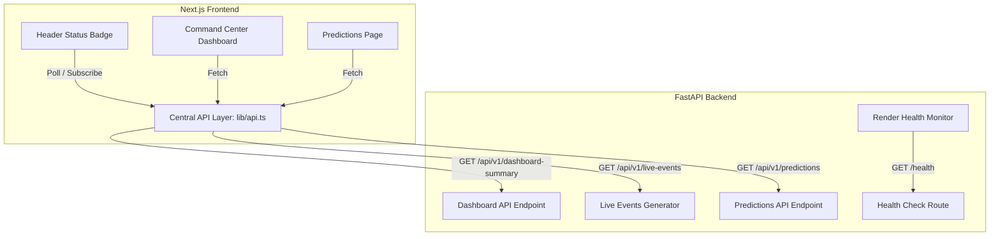

# KumbhForce AI - Full-Stack Integration Report

KumbhForce AI has been successfully upgraded from a frontend-only simulation into a functional full-stack platform with a live FastAPI backend serving data directly to our Next.js frontend app.

## 🚀 Deployment Status

| Environment | Service URL | Health Status |
| :--- | :--- | :--- |
| **Frontend (Next.js)** | [https://kumbhforce-ai.vercel.app](https://kumbhforce-ai.vercel.app) | 🟢 Operational |
| **Backend (FastAPI)** | [https://kumbhforce-api.onrender.com](https://kumbhforce-api.onrender.com) | 🟢 Online |
| **Health API** | [https://kumbhforce-api.onrender.com/health](https://kumbhforce-api.onrender.com/health) | 🟢 Healthy (200 OK) |

---

## 🔗 Connected Architecture Diagram



---

## 🛠️ Connected API Endpoints

### 1. **Health Verification API**
- **Endpoint:** `GET /health`
- **Purpose:** Serve as the official Render deployment health monitor.
- **Sample Payload:**
  ```json
  {
    "status": "healthy",
    "service": "KumbhForce AI Operations Engine API",
    "version": "1.0.0"
  }
  ```

### 2. **Dashboard Summary API**
- **Endpoint:** `GET /api/v1/dashboard-summary`
- **Purpose:** Dynamically populate current active volunteers, incidents, readiness scores, and predicted gaps.
- **Sample Payload:**
  ```json
  {
    "activeVolunteers": 487,
    "activeIncidents": 4,
    "readinessScore": 87,
    "riskLevel": "Medium",
    "predictedShortage": 22,
    "lastUpdated": "2026-06-07T05:32:06.795Z"
  }
  ```

### 3. **Live Operations Feed API**
- **Endpoint:** `GET /api/v1/live-events`
- **Purpose:** Serves 15 live operational events to the Command Center log.
- **Sample Payload:**
  ```json
  [
    {
      "id": "ev-1000",
      "timestamp": "12:00:00",
      "category": "Safety",
      "severity": "Minor",
      "sector": "S-04",
      "message": "Sector 4: Boundary security scan verified. All nodes stable."
    }
  ]
  ```

### 4. **Staffing Predictions API**
- **Endpoint:** `GET /api/v1/predictions`
- **Purpose:** Serve crowd forecasting arrays (1h, 3h, 6h, 12h) and alert matrices to the Predictions view.
- **Sample Payload:**
  ```json
  {
    "sectorForecasts": { ... },
    "predictiveAlerts": [ ... ],
    "generatedAt": "2026-06-07T05:32:06.795Z"
  }
  ```

---

## 💻 Integrated Pages & Components

1. **Global Header (`frontend/components/layout/header.tsx`)**
   - Implements a global connection badge checking live API availability.
   - States: `🟢 Backend Connected` (live communication) or `🔴 Offline Demo Mode` (graceful client-side fallback).

2. **Command Center Dashboard (`frontend/components/pages/command-center-dashboard.tsx`)**
   - Fetches `dashboard-summary` and `live-events` from the API.
   - Includes custom loading skeletons during fetch, a manual/automatic "Retry Connection" button, and fallback triggers.

3. **Predictions Page (`frontend/app/predictions/page.tsx`)**
   - Fetches forecast datasets and alert streams from `predictions`.
   - Incorporates loading skeletons, retry triggers, and a sync time indicator badge.

---

## 📸 Key Judging Screenshots to Capture

1. **Dashboard Home Page**
   - Capture the top bar status badge showing `🟢 Backend Connected` and the active volunteers card reflecting backend-synced figures.
2. **Live Feed Logs**
   - Capture the left-hand column "Live Operations Feed" showing events starting from id `ev-1000` fetched from Render.
3. **Predictive Analytics Page**
   - Capture the sync timestamp badge showing `Synced: [Timestamp]` retrieved dynamically from the backend forecasts.

---

## 🔍 Technical Debt & Future Roadmap
- **WebSockets Implementation:** Migrate live events telemetry from polling/mount fetches to true full-duplex WebSockets (stubbed under `/api/v1/ws/telemetry`).
- **Database Persistence:** Link mock databases (`kumbhforce.db`) with active CRUD operations to persist volunteer check-ins.
